# donebench

**用自己的真实任务，找到刚刚好的模型。**

把同一份任务交给不同模型和启动器，直接比较交付的作品、参考评分、耗时与 token。
代码修复、报告生成、工具调用、SVG 动画，都可以成为你的评测题。

[打开完整交互报告 ↗](https://huajuan404.github.io/donebench/) · [快速开始](#快速开始) · [加入自己的任务](#加一个用例)

<a href="https://huajuan404.github.io/donebench/">
  <picture>
    <source media="(max-width: 760px)" srcset="docs/assets/report-mobile.svg">
    
  </picture>
</a>

上面四份作品直接保留模型输出中的 **SMIL 动画**，轮子、踏板和腿脚的运动都留在 README 里。
点击首图，在完整报告里切换参考分与耗时、放大对照作品、展开裁判依据。

<sub>真实运行快照 · 每格 1 次 · 分数为裁判参考分 · 比较的是启动器与模型的组合。</sub>

## 快速开始

准备 Python 3.11+，以及已配置好的模型 CLI。下面用 `codex` 和 `claude` 跑同一份 SVG 任务；
`runner` 就是 [runners.yaml](runners.yaml) 中一个有名字的启动配置，可换成你本机可用的条目。

```bash
git clone https://github.com/huajuan404/donebench.git
cd donebench
python3 -m venv .venv
source .venv/bin/activate
python3 -m pip install pyyaml

./run.sh -l
./run.sh -c 2026-09-15-001-flamingo-bicycle -r codex,claude
```

完成后打开 `runs/<run_id>/report.html`，就能并排查看作品、分数和耗时。
同目录的 `scorecard.md` 是文本摘要，`cells/` 保存每格的原始产物与记录。
上面的示例每组运行一次；追加 `--repeat 3` 可以做多轮对比。
这道 SVG 题的裁判需要浏览器观察能力；无法完成观察时会保留作品、不给分。

## 加一个用例

先写清三件事：**模型收到什么、需要交付什么、怎样判断做得好不好。**
一个 case 固定这份题目与判分方式，运行时再选模型。

```text
cases/my-svg/
├── case.yaml
└── prompts/
    ├── task.md
    └── rubric.md
```

最小配置如下。`task.md` 写任务并约定保存为 `scene.svg`；`rubric.md` 写评分标准，满分与配置一致。

```yaml
schema_version: 2
task: prompts/task.md
judge: prompts/rubric.md
expected:
  output_file: scene.svg
  max_score: 10
```

需要输入文件就放进 `input/`；有自动校验脚本时增加 `check: check.sh`，校验基准放在不会拷给模型的 `verify/`。
完整示例可看 [火烈鸟 case](cases/2026-09-15-001-flamingo-bicycle/README.md)。

### 已经做过的任务，可以从 session 提取

[session-to-eval](.claude/skills/session-to-eval/SKILL.md) 支持从当前对话或历史任务记录生成草稿，例如：

> 把刚才生成动画 SVG 的任务抽成 case。
>
> 把历史里给旅行照片分类的任务抽成 case。

生成后补齐真实输入与评分依据，再参与比较；静态校验通过只代表结构可用。

<details>
<summary>首次安装 session-to-eval</summary>

```bash
cp .claude/skills/session-to-eval/config.example.toml .claude/skills/session-to-eval/config.toml
# 编辑 config.toml，填写 ai_eval_path；私有用例另填 private_cases_path
bash .claude/skills/session-to-eval/install.sh
```

安装会把源码软链到 Claude Code、Codex 和 `.agents` 的 skills 目录。

</details>

<details>
<summary>不公开的任务放在哪里？</summary>

把 case 放到仓库外，在 `private.env` 中设置 `AI_EVAL_PRIVATE_CASES`：

```bash
cp private.env.example private.env
# 将 private.env 中的路径改成仓库外的 case 目录
./run.sh -l
```

`run.sh` 会同时发现公开和私有 case，私有运行结果也留在私有根目录。
原始报告可能包含输入和输出正文，分享前需要复核。不要把非公开素材放进公开仓库。

</details>

## 继续比较模型或提示词

**比较模型**：在 `-r` 后列出多个 runner，如 `-r codex,claude`。
新增模型时编辑 [runners.yaml](runners.yaml)；选手和裁判共用这份注册表，凭证通过环境变量引用。

**比较提示词**：在同一个 case 中定义不同版本，再固定一个 runner 运行。
例如把前面 `case.yaml` 的 `task` 改为：

```yaml
task:
  variants:
    short: prompts/short.md
    detailed: prompts/detailed.md
  default: short
```

写好这两份提示词后运行：

```bash
./run.sh -c my-svg -r codex --variants short,detailed --repeat 3
```

两种比较可以组合使用。保持输入素材与判分方式一致，才能解释差异；
不传 `--variants` 时只运行默认版本。若 case 自己声明了 `repeat`，以它为准。

## 读懂结果，再做选择

先检查交付物，再看判分依据，最后比较满足需求的方案花了多少时间与资源。
例如 SVG 任务要实际观察车轮、踏板和腿脚的运动关系，不能只看一个总分。

| 你关心什么 | 报告里看哪里 |
|---|---|
| 是否满足要求 | `check` 和任务完成度。没有可用判据或评分时显示“未评”，不等于失败。 |
| 好在哪里、差在哪里 | 原始作品、裁判维度分与理由。裁判分是参考，不能替代实际交付证据。 |
| 花了多少资源 | 生成耗时、含缓存读写的 token；费用没有可信来源时显示 `—`。 |

单次结果只说明这次任务；多轮运行才能进一步观察稳定性。比较对象是**启动器 + 模型**的组合，
工具、插件和运行环境都会影响结果，也不把不同任务的参考分加成一个“总冠军”。

<details>
<summary>重建报告或换裁判</summary>

```bash
./run.sh --report <run_id>                 # 重建 HTML，不重跑模型
./run.sh --rejudge <run_id> -j <judge>     # 只重新判分，并更新报告
```

裁判名称来自 `runners.yaml`。报告展示范围可通过运行目录里的 `report_view.json` 调整，
它不会修改原始运行选择；约束见 [report_view.py](bench/report_view.py)。

</details>

## 维护与开发

日常配置看 [config.yaml](config.yaml) 和 [runners.yaml](runners.yaml)；
模块职责、用例约定和测试命令统一放在 [AGENTS.md](AGENTS.md)。

<details>
<summary>更新 README 动态演示</summary>

公开展示保存在 `docs/`，由 GitHub Pages 的 `main:/docs` 发布。
它复用已审核的 SVG 与评测数据，保留原始动画和作品缺陷。

```bash
python3 -m bench.showcase --import-run runs/<run_id>
python3 -m bench.showcase --check
```

只调整展示代码时运行 `python3 -m bench.showcase` 即可重建。
当前导出限定为上面的两个 SVG case × `kimi-k3`、`glm-5.3`，每格一次；
普通 `runs/` 不会自动发布，原始日志、本机配置和任意额外文件不进入导出。

</details>

[MIT License](LICENSE)
