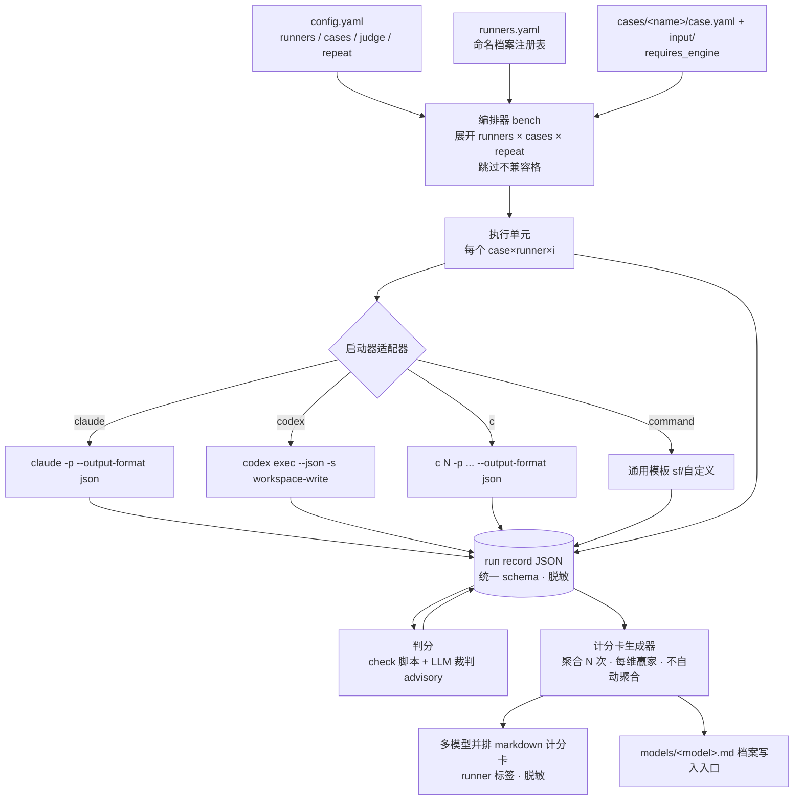
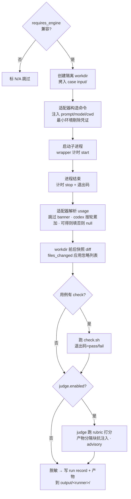

# feat: 可换模型的端到端 agent benchmark 编排器

## Summary

把本项目从空壳骨架升级为一个能跑、能判、能分享的个人 agent benchmark：一个用例 = 一个端到端 agent 任务 + 一个可换的「启动器」，benchmark 只替换模型/启动器再重跑同一任务，自动采集质量、耗时、token/成本、agentic 行为四维指标，产出一张多模型并排的计分卡。本期端到端打通并用 1 个真实用例验证全链路。

---

## Problem Frame

面对一个真实工作任务，应该用 codex、GLM 5.1、MiniMax-M3 还是 Opus？官方 benchmark（SWE-bench 之类）回答不了「我自己的活该交给谁」。出了新模型，除了官网指标，没有一手、可复现、贴合自己工作流的判据来决定它能否替换口粮模型。

现状：`run.sh` 是空壳（配置解析 `TODO`，只 `cat` README），`config.yaml` 为空，`cases/ models/ prompts/` 全是 `.gitkeep`，没有任何真实用例。已有的资产只有模型切换器 `c`（`/Users/duying/Desktop/Works/code/tools/c`，已在 PATH，交互式 `exec claude`）和它同目录的 `config.env`（CONFIG_0..7 模型映射）。「一键对比」能力几乎完全未建。

关键认知：本 benchmark 不是 prompt 进 / 答案出的纯问答评测，而是**换 LLM 来做同一个端到端 agent 任务**的对比——任务可能是跑一个 skill、一个 plugin、多个 skill、一个自定义斜杠命令。因此系统的核心抽象不是「调 API」，而是「可插拔的启动器（launcher）」。

诚实边界（审查结论）：不同启动器自带不同 agent harness（claude -p 带 Claude Code 的 system prompt/工具/agent loop；codex exec 带 Codex 的；`c N` 是经路由改写模型的 Claude Code）。因此本 benchmark 比较的是**「启动器 + 模型」捆绑**，不是裸模型。这一点必须在计分卡与文档里明确标注，避免把「codex 不如 claude」误读为模型差异，而真因可能是 harness。

---

## Requirements

### 启动器与模型抽象

- R1. 存在一个 benchmark 自有的、命名的 runner 档案注册表（独立于 `config.env`，但可登记 `c N` 类启动器），每个档案 = 标签 → `{启动器类型, 模型, 参数}`。
- R2. 支持至少四类启动器适配器：`claude`（`claude -p`）、`codex`（`codex exec`）、`c`（复用 PATH 上的 `c N`）、`command`（通用模板，覆盖 sf cli / 自定义斜杠命令 / 任意外部 agent）。
- R3. 「跑用例的模型（runner）」与「裁判模型（judge）」共用同一套档案注册表与配置语法；二者都支持默认 + 覆盖。默认 runner = `codex`，默认 judge = `claude`。
- R4. 一次运行支持「多个 runner × 多个 case」的矩阵执行——同一用例同时喂给多个模型即为默认主线（一键对比）。

### 用例模型

- R5. 用例（case）与模型解耦：用例只声明「任务 + 校验（check）+ 裁判 rubric + 输入资产 + 引擎兼容性」，不绑定任何具体模型。
- R6. 用例任务类型可表达端到端 agent 任务：纯 prompt、运行 skill、运行自定义斜杠命令、自定义命令。
- R7. 每个 (case × runner) 在隔离工作目录中运行，agent 对文件的修改互不污染，且不污染用例源目录。
- R19. 用例可声明 `requires_engine`（如 `claude`）；矩阵展开时跳过不兼容的 (case × runner)，计分卡标 `N/A — 任务非该引擎可移植`，而非给出误导性 fail/低分。

### 执行与指标

- R8. 采集四维指标：质量/正确性、速度/耗时、token 用量/成本、agentic 行为（轮数、改动文件数、命令数）。
- R9. 墙钟耗时由编排器 wrapper 永远能测；token/成本/轮数在启动器能吐出可解析 usage 时采集（`claude -p --output-format json`、`codex exec --json` 按轮累加；codex 无 cost 字段，cost 维度对 codex 降级为 null），自定义引擎缺失时优雅降级为「不可用」而非失败。
- R10. 每个 (case × runner) 落一份统一 schema 的运行记录（run record），作为执行 → 判分 → 计分卡之间的唯一数据契约。
- R17. 每个 (case × runner) 支持 `repeat: N`（默认 1）；N>1 时按维度报告中位数 + 离散度（min/max 或标准差），以支撑「可靠」结论而非单样本噪声。

### 判分

- R11. 三层判分：用例自带可验证 check（脚本退出码，pass/fail）→ LLM 裁判按 rubric 兜底打分 → 你的人工备注位。
- R12. LLM 裁判通过 judge 档案运行（默认 `claude`，可配）；裁判分作为 **advisory**（有 check 时以 check 为质量锚），被测与裁判同源时标注 `same_source: true`（比较前对 model 标签规范化）。计分卡须把 judge 模型标在每个质量格上，提示跨家族偏置。

### 报告与分享

- R13. 生成多模型并排计分卡（每用例：模型 × 四维 + 每维赢家 + 权衡摘要），输出为可分享的 markdown。
- R14. 计分卡可沉淀进 `models/<model>.md` 模型档案（本期至少提供写入入口；自动聚合更新可后续）。
- R18. 计分卡**不自动聚合**四维为单一分数；呈现每维赢家 + 结构化权衡摘要（如「codex 省钱、claude 质量高」），最终结论由用户判定。
- R21. 计分卡与模型档案以 runner（启动器 + 模型）标签标注，总览注明 harness 是结论的已知混淆变量（见 Problem Frame 诚实边界）。

### 配置与易用性

- R15. `config.yaml` 表达一次运行：`runners: [标签]`、`cases: [名]`（空=全部）、`judge: 标签`、`repeat: N`、四维开关。
- R16. `run.sh` 退化为薄入口委托给 Python 编排器，保留 `-c/--case`、新增 `-r/--runners`、保留 `-l/--list`。

### 安全与可分享

- R20. 凭证不进入子进程环境（按需最小注入，剔除无关 token）；原始 stdout/stderr、`judge.reasoning`、`check.detail` 进入可分享产物前需脱敏（识别 `sk-*`/bearer/URL 内嵌凭证等模式）；`runners.yaml` 禁止明文密钥（用 env 插值，注册表校验拒绝疑似密钥）；所有 `output/` 产物（不只 `run.json`）都纳入 `.gitignore`。

---

## Key Technical Decisions

- KTD1. **编排器用 Python 重写，替换空壳 bash `run.sh`。** 需要解析 JSON/JSONL usage、跑判分、生成计分卡、隔离工作目录、聚合多次运行——bash 不划算。`run.sh` 退化为薄 shim（`exec python3 -m bench "$@"`）。项目 CLAUDE.md 已有 Python 规范，`tools/router.py` 也是 Python，技术栈一致。

- KTD2. **核心抽象 = 启动器适配器（Launcher Adapter）+ runner 档案。** 准确表述是「**统一的 run record 输出契约 + 各自不同的命令构造/模型注入**」：每个适配器知道三件事——(a) 如何构造命令、(b) 如何注入 prompt/model/cwd、(c) 如何解析 usage。四类适配器在输出契约上统一，但在 cwd 注入方式（claude 默认 cwd vs codex `-C` vs c 启动目录）、模型选择（codex `-m` vs c 的 env override vs command `{model}` 占位）、所需 flag 上各不相同——`runners.yaml` 文档须明确每类 launcher 的必填字段差异，避免「一套配置语法」被误解为各 launcher 等价。runner 与 judge 都是「用某适配器跑某模型完成一个任务」，统一概念降低理解成本（R1/R2/R3）。

- KTD3. **`c N` 无需改动即可当无头启动器。** `c` 末尾是 `exec claude ... "$@"`，因此 `c <config> -p "<prompt>" --output-format json` 会把无头参数透传给 claude（已实测 `c 1 -p ... --output-format json` 正常返回单 JSON 并自然退出，`--teammate-mode tmux` 不干扰 `-p`）。适配器通过 PATH 调裸 `c`（已验证在 PATH），不拼路径。**注意**：`c` 的 `start_single` 会先打印多行 banner（🚀 启动…/API/模型 等）再输出 claude 的 JSON，解析器必须先定位 stdout 中首个 JSON 起始字符再解析（见 KTD5）。

- KTD4. **统一 run record schema 作为系统脊柱。** 一个 JSON 对象贯穿执行→判分→计分卡：
  ```
  { case, runner_label, runner_model, launcher_type,
    repeat_index, started_at, duration_ms, exit_code, is_error,
    usage:   { input_tokens, output_tokens, total_tokens, cost_usd } | null,  // cost_usd 可为 null（codex 无）
    agentic: { num_turns | null, files_changed, commands_run | null },
    check:   { ran, passed, detail },
    judge:   { ran, model, same_source, score, max, dimensions:{...}, reasoning } | null,
    human_note, artifacts_dir }
  ```
  `usage`/`cost_usd`/部分 `agentic` 允许为 null（R9 优雅降级），下游计分卡对 null 显示「—」。同一 (case × runner) 的 N 次运行产出 N 条 record（`repeat_index` 区分），计分卡聚合（KTD11）。

- KTD5. **指标来源分两路。** 墙钟耗时与退出码：编排器对子进程计时，永远可得。token/成本/轮数：适配器解析启动器输出——
  - `claude`/`c`：解析单 JSON，取 `total_cost_usd`、`usage.input_tokens`、`usage.output_tokens`、`num_turns`、`is_error`、`duration_ms`；解析前跳过非 JSON 前缀（c 的 banner 必需）；model 标签规范化去除 `[1m]` 等残留（供 same_source 比较）。
  - `codex`：解析 JSONL，对**所有** `turn.completed` 事件的 `usage`（`input_tokens`/`output_tokens` 等）**求和**得累计 token（不可只读末尾单条）；codex **无 cost_usd**，cost 维度降级为 null。
  - `command`：默认 `metrics: none`，仅保留墙钟。
  - agentic 的 `files_changed` 由编排器对隔离工作目录做前后快照 diff 统一计算（对所有适配器可得），并应用**忽略列表**（`.omx/`、`.git/`、缓存/lock 等 launcher 自建产物），避免引擎自建目录污染计数、破坏跨 launcher 可比性。`files_changed` 视为**无方向的诊断元数据**，计分卡只与 check/judge 结论并列解读，不单独作为可比「质量」维度。

- KTD6. **隔离工作目录 + 最小子进程环境。** 每个 (case × runner) 在临时目录内运行：把 `cases/<name>/input/` 拷入新建 workdir，启动器 cwd 指向它（claude 默认 cwd、codex `-C`、`c` 在该目录启动），运行后把产物与 run record 落到 `cases/<name>/output/<runner标签>/`，临时目录在 `finally` 中清理（R7）。子进程用**显式最小环境**：只注入该 launcher 必需变量，剔除无关凭证 token（R20）；record 写入器对原始输出做密钥脱敏后再落盘。注意 workdir 隔离是整洁性措施而非安全沙箱——本期对「选手模型执行任意命令」接受本机风险（个人工具），但凭证最小化 + 脱敏是硬要求。

- KTD7. **判分分级触发。** 有 `check` 脚本的用例先跑 check（确定性 pass/fail）；`judge.enabled` 为真则额外跑 LLM 裁判按 rubric 打分。两者都不阻塞对方，结果都进 run record（R11）。

- KTD8. **codex 默认 `-s workspace-write`。** 实测 `codex exec` 默认只读沙箱，agent 无法写文件（"本轮环境是只读沙箱"），会让默认 runner 的写文件型种子用例直接失败。codex 适配器须把 sandbox 模式作为档案显式参数，默认 `workspace-write`（写权限限定在隔离 workdir）。`--ephemeral` 只控会话持久化、与写权限无关，不在写文件论述中出现。

- KTD9. **比较口径 = 启动器 + 模型捆绑。** 见 Problem Frame 诚实边界。计分卡行与 `models/<model>.md` 用 runner 标签标注，总览声明 harness 为已知混淆变量。这不削弱工具价值（用户要的就是「我用 codex 还是 claude 跑这活」的端到端答案），但禁止把结论上升为裸模型优劣。

- KTD10. **裁判设计三要点。** (a) **产物访问**：judge prompt 取 runner 产物——小产物内联进 prompt，大产物则把 judge 适配器 cwd 指向 `output/<runner>/` 并在 prompt 指示读取文件（U5 给出契约，不留给实现者临场决定）。(b) **抗注入**：runner 产物用明确分隔块包裹（如 `<contestant_output>…</contestant_output>`）并声明块内为不可信内容、不得覆盖打分指令。(c) **结构化输出**：U5 实现前先 `claude --help | grep json-schema` 确认 `--json-schema` 存在；不稳则提交回退路径（解析 `--output-format json` 的 `result` + 宽松 JSON 提取），锁定单一实现路径与 fixture。

- KTD11. **多次运行聚合（repeat）。** `repeat: N`（config 全局，可被 case 覆盖；默认 1）。N>1 时编排器对同一 (case × runner) 跑 N 次产出 N 条 record，计分卡按维度报告中位数 + 离散度；check 报告 pass 率。默认 1 时退化为单次但计分卡明确标注样本数。

- KTD12. **结论不自动聚合。** 计分卡呈现每维赢家 + 结构化权衡摘要，最终「该用哪个」由用户判定（R18）。理由：四维不可通约，黑箱加权分会把主观权重伪装成客观结论，违背 north star。

---

## High-Level Technical Design

### 组件与数据流



### 单个 (case × runner × repeat) 执行时序



---

## Output Structure

```
ai-eval/
├── run.sh                      # 薄 shim → python3 -m bench
├── config.yaml                 # 一次运行配置（runners/cases/judge/repeat/dimensions）
├── runners.yaml                # 命名 runner 档案注册表（新增，禁明文密钥）
├── bench/                      # Python 编排器包（新增）
│   ├── __init__.py
│   ├── __main__.py             # CLI 入口（-c/-r/-l）
│   ├── registry.py             # runner 档案加载、解析、密钥校验
│   ├── adapters/               # 启动器适配器
│   │   ├── __init__.py
│   │   ├── base.py             # 适配器接口 + run record 构造
│   │   ├── claude.py
│   │   ├── codex.py
│   │   ├── c.py
│   │   └── command.py
│   ├── case.py                 # 用例加载 + 隔离 workdir + requires_engine
│   ├── orchestrator.py         # 矩阵×repeat 执行 + 计时 + diff 快照 + 最小环境
│   ├── scoring.py              # check 脚本 + LLM 裁判（抗注入/advisory）
│   ├── scorecard.py            # 计分卡（聚合 N 次/每维赢家/不自动聚合）+ 档案写入
│   ├── scrub.py                # 密钥/PII 脱敏（record 写入与计分卡共用）
│   └── record.py               # run record schema 与读写
├── cases/
│   └── <seed-case>/            # 本期种子用例
│       ├── case.yaml           # 含 requires_engine
│       ├── input/
│       ├── prompts/{task.md,rubric.md}
│       ├── check.sh
│       ├── expected/
│       └── output/<runner标签>/    # gitignored（全部产物）
├── models/                     # 模型档案（计分卡沉淀目标）
└── tests/                      # pytest（新增；discovery 目录，无需 __init__.py）
```

每单元的 `**Files:**` 为权威；实现中若发现更优布局可调整。

---

## Implementation Units

### U1. Runner 档案注册表 + 启动器适配器框架

- **Goal**：建立核心抽象——命名 runner 档案注册表 + 适配器接口，让 runner/judge 共用同一套配置（R1/R2/R3/R20，KTD2）。
- **Dependencies**：无（地基）。
- **Files**：`runners.yaml`、`bench/__init__.py`、`bench/registry.py`、`bench/adapters/__init__.py`、`bench/adapters/base.py`、`bench/record.py`、`tests/test_registry.py`、`tests/test_adapter_base.py`
- **Approach**：
  - `runners.yaml` 顶层 `runners:` 映射，每档案 `{launcher, model?, config?(c用), sandbox?(codex用), template?(command用), metrics?}`。`registry.py` 解析为不可变档案对象，按标签查询，校验未知 launcher 类型与缺失必填字段报错；**校验拒绝疑似明文密钥**（`sk-*`/bearer/长 token），凭证须用 `${ENV_VAR}` 插值（R20）。
  - `base.py` 定义适配器接口：`build_command(profile, task, workdir) -> argv`、`build_env(profile) -> dict`（最小环境）、`parse_usage(stdout, stderr, exit_code) -> usage|None`、`supports_usage`。`record.py` 定义 run record schema（KTD4）构造与 JSON 读写，`usage`/`cost_usd`/`agentic` 字段允许 null。
  - 档案对象用新对象表达覆盖（default + per-run），不就地改。
- **Patterns to follow**：`config.env` 的 `CONFIG_N_*` 字段语义；不可变更新遵循 coding-style.md。
- **Execution note**：注册表解析与 record schema 是纯输入/输出契约，test-first。
- **Test scenarios**：
  - 解析含 4 类 launcher 的 `runners.yaml` → 4 个档案对象，字段正确。
  - 引用未知 launcher 类型 → 抛出清晰错误。
  - 缺失必填字段（`c` 类缺 `config`）→ 校验报错并指明档案标签。
  - `runners.yaml` 内出现疑似明文密钥 → 校验拒绝并提示用 env 插值。
  - 按标签查询不存在的档案 → 明确错误。
  - run record 构造：`usage=None`/`cost_usd=None` 时序列化/反序列化往返一致。
  - 覆盖（per-run model 覆盖档案 model）返回新对象，原档案不变。
- **Verification**：`pytest tests/test_registry.py tests/test_adapter_base.py` 全绿；能从 `runners.yaml` 加载出 codex/claude/c/command 四档案。

### U2. 具体启动器适配器（claude / codex / c / command）

- **Goal**：实现四类适配器的命令构造、最小环境与 usage 解析（R2/R9，KTD3/KTD5/KTD8）。
- **Dependencies**：U1。
- **Files**：`bench/adapters/claude.py`、`bench/adapters/codex.py`、`bench/adapters/c.py`、`bench/adapters/command.py`、`tests/test_adapters.py`、`tests/fixtures/`（样例 claude JSON / 多轮 codex JSONL / 带 banner 的 c stdout）
- **Approach**：
  - `claude`：`claude -p <prompt> --output-format json`，cwd=workdir；`parse_usage` 取 `total_cost_usd`/`usage.input_tokens`/`usage.output_tokens`/`num_turns`/`is_error`/`duration_ms`；解析前定位首个 JSON 字符。
  - `codex`：`codex exec <prompt> --json -C <workdir> --skip-git-repo-check -s workspace-write`，`-m` 注入模型（KTD8）；`parse_usage` 对所有 `turn.completed.usage` **求和**，cost 置 null（codex 无 cost）。
  - `c`：`c <config> -p <prompt> --output-format json`（透传，KTD3），usage 解析**复用 claude 解析器但先跳过 banner 前缀**；model 标签规范化去 `[1m]`。
  - `command`：渲染 `template`，支持占位符 `{prompt}`/`{prompt_file}`/`{cwd}`/`{model}`/`{skill}`；`metrics: none` → `parse_usage` 返回 None，`supports_usage=False`。
  - skill / 斜杠命令类任务通过 claude/c 适配器的 prompt 注入（如 `/skill-name args`）或 command 模板表达；非该引擎可移植的任务由 `requires_engine` 在编排层拦截（U3/U4）。
- **Patterns to follow**：`c` 的参数透传与 env 注入方式；codex/claude `--help` 已确认的 flag。
- **Execution note**：usage 解析是脆弱点，用真实样例 fixture test-first（含多轮 codex、带 banner 的 c）。
- **Test scenarios**：
  - claude：样例 JSON → usage 四字段 + num_turns + is_error 正确；`is_error:true` → record `is_error=True`。
  - codex：多轮 JSONL → token 为各轮累加和（非末尾单条）；cost 恒为 null；无 usage 事件 → token None。
  - c：构造的 argv 形如 `c 2 -p ... --output-format json`；stdout 带 banner 前缀仍能解析出 JSON；model 标签 `xxx[1m]` 规范化为 `xxx`。
  - command：占位符全部替换；缺必需占位符 → 构造期报错；`metrics:none` → usage=None 且 `supports_usage=False`。
  - 各适配器 `build_env` 只含必需变量，不含无关凭证。
- **Verification**：`pytest tests/test_adapters.py` 全绿；四适配器对各自 fixture 解析正确，降级路径返回 None 不抛错。

### U3. 用例加载 + 隔离工作目录

- **Goal**：定义 case.yaml 格式（含 `requires_engine`）、加载用例、provision 隔离 workdir 与快照能力（R5/R6/R7/R19，KTD6）。
- **Dependencies**：无（可与 U1 并行）。
- **Files**：`bench/case.py`、`tests/test_case.py`、`cases/.gitkeep`（保留）
- **Approach**：
  - `case.yaml`：`name`、`task: {type, prompt_file?, skill?, args?}`、`check: {type, script?}`、`judge: {enabled, rubric_file?, dimensions?}`、`requires_engine?`、`repeat?`（覆盖全局）。
  - 加载器校验 task 类型与必填字段；解析 prompt_file/rubric_file 为文本。
  - workdir provisioning：建临时目录 → 拷 `input/` → 返回路径；运行后把产物复制到 `output/<runner>/`，临时目录 `finally` 清理。提供前后文件快照能力（应用忽略列表，供 U4 算 files_changed）。
- **Patterns to follow**：现有 `cases/<name>/{input,prompts,expected,output}` 约定与 `.gitignore` 的 output 规则。
- **Execution note**：workdir 隔离正确性关系到「不污染源目录」，test-first。
- **Test scenarios**：
  - 加载合法 case.yaml（prompt 型）→ 字段正确；skill/slash 型 → task.type 与 skill/args 正确。
  - 含 `requires_engine: claude` → 正确解析。
  - task 缺必填（prompt 型缺 prompt_file）→ 报错指明用例名。
  - provision workdir → `input/` 被拷入，源 `input/` 不被修改。
  - workdir 改动 N 个文件 → 快照 diff 报告 N；`.omx/`/`.git/`/缓存改动 → 不计入。
  - 运行后源用例目录无残留临时文件。
- **Verification**：`pytest tests/test_case.py` 全绿；隔离运行不污染 `cases/<name>/input/`。

### U4. 编排器：矩阵 × repeat 执行 + 指标采集

- **Goal**：跑 `runners × cases × repeat` 矩阵，跳过不兼容格，逐单元最小环境计时、调适配器、算 files_changed、产出 run record（R4/R8/R9/R10/R17/R19，KTD5/KTD6/KTD11）。
- **Dependencies**：U1、U2、U3。
- **Files**：`bench/orchestrator.py`、`tests/test_orchestrator.py`
- **Approach**：
  - 解析 config.yaml 的 runners/cases/repeat（空=全部）→ 展开矩阵；对 `requires_engine` 不兼容的 (case × runner) 标 N/A 跳过。
  - 每单元跑 `repeat` 次：provision workdir → 适配器 `build_command`+`build_env`（最小环境）→ 子进程运行并 wall-clock 计时 → 捕获 stdout/stderr/exit → 适配器 `parse_usage` → workdir 前后快照算 files_changed（忽略列表）→ 脱敏 → 组装 run record（带 `repeat_index`）→ 落 `output/<runner>/run.<i>.json` + 脱敏后原始输出。
  - 单元失败（崩溃/超时）记 `is_error=True`、`exit_code`，不中断其他单元。
  - 提供可注入「假适配器」用于测试（不真起子进程）。
- **Patterns to follow**：`run.sh` 现有 case 目录遍历与颜色输出风格；不可变 record 组装。
- **Test scenarios**：
  - 2 runner × 1 case × repeat 2 → 4 份 record，`repeat_index` 0/1 正确。
  - `config cases: []` → 遍历全部用例。
  - 注入假适配器固定 usage → record usage 正确；usage=None → record `usage` 为 null，不抛错。
  - 单个单元抛异常 → 该单元 `is_error=True`，其余仍完成。
  - wall-clock：mock 计时 → `duration_ms` 正确。
  - files_changed：workdir 改 N 文件 + launcher 自建 `.omx/` → `files_changed==N`（忽略 `.omx/`）。
  - `requires_engine` 不兼容的 (case×runner) → 标 N/A 跳过，不产 record。
  - 子进程环境不含无关凭证（断言 `build_env` 结果）。
- **Verification**：`pytest tests/test_orchestrator.py` 全绿；用假适配器跑 2×1×repeat2 产出 4 份合法 record。

### U5. 判分：check 脚本 + LLM 裁判（抗注入 / advisory）

- **Goal**：实现确定性 check + 可换 judge 档案的 LLM 打分，含产物访问契约、抗注入、advisory 与回退路径（R11/R12，KTD7/KTD10）。
- **Dependencies**：U2（judge 复用适配器）、U3（rubric/check 来自用例）、U4（run record 容器）。
- **Files**：`bench/scoring.py`、`tests/test_scoring.py`
- **Approach**：
  - check：用例有 `check.script` 则在产物目录跑脚本，退出 0=pass，捕获输出存 `check.detail`。
  - judge：`judge.enabled` 为真时按 config 的 `judge:` 标签取档案，组装 prompt：rubric + 用例任务 + **runner 产物（用 `<contestant_output>` 分隔块包裹并声明不可信、不得覆盖打分指令）**；产物访问按 KTD10——小产物内联，大产物把 judge cwd 指向 `output/<runner>/` 并指示读文件。结构化输出走 `--json-schema`，实现前确认其存在，否则回退解析 `result` + 宽松 JSON 提取。结果写 `run record.judge`，**judge 分为 advisory**（计分卡有 check 时以 check 为质量锚）。
  - same_source：被测 runner 与 judge 规范化后同源 → `judge.same_source=True`。
  - 人工备注位：`human_note` 字段（计分卡可显示，本期不强制）。
- **Patterns to follow**：U2 适配器接口；claude `--json-schema`/`--output-format json`（`--help` 已确认）。
- **Test scenarios**：
  - check 退出 0 → `passed=True`；非 0 → `False`，detail 含输出；`check.type:none` → `ran=False`。
  - judge：假 judge 适配器返回结构化分数 → `run record.judge` 正确填充。
  - judge prompt 中 runner 产物被 `<contestant_output>` 包裹（断言 prompt 结构）。
  - 产物超过内联阈值 → judge cwd 指向 `output/<runner>/`（断言 cwd）。
  - 被测=judge 规范化后同源 → `same_source=True`。
  - judge 返回非法 JSON → 走回退提取；仍失败则 `score=null` 存 raw（脱敏），不崩溃。
- **Verification**：`pytest tests/test_scoring.py` 全绿；check 与 judge 可对同一 record 共存写入。

### U6. 计分卡生成（聚合/每维赢家/不自动聚合）+ 模型档案写入

- **Goal**：把多份 run record 聚合成多模型并排计分卡（runner 标签、每维赢家、权衡摘要、N 次中位数+离散度、脱敏），并提供写入 `models/<model>.md` 入口（R13/R14/R18/R21，KTD9/KTD11/KTD12）。
- **Dependencies**：U4（run record schema）、U5（judge/check 字段）、`bench/scrub.py`。
- **Files**：`bench/scorecard.py`、`bench/scrub.py`、`tests/test_scorecard.py`、`models/.gitkeep`（保留）
- **Approach**：
  - 读某次运行所有 `output/<runner>/run.*.json`，按用例分组；N>1 时按维度算中位数 + 离散度，check 算 pass 率。
  - 生成「runner（启动器+模型）× 四维」表格 + **每维赢家** + **结构化权衡摘要**（不自动聚合单一分，R18/KTD12）；null 显示「—」；`files_changed` 作诊断列与 check/judge 并列；`N/A` 格标注不兼容。
  - 顶部总览：参与 runner、用例数、样本数、**harness 混淆变量声明**（R21/KTD9），judge 模型标注。
  - **脱敏**：`scrub.py` 在生成可分享 markdown 前对 `judge.reasoning`/`check.detail`/原始片段做密钥/PII 脱敏（R20），可对超长字段截断。
  - 档案写入入口：把某 runner 本次表现追加/更新到 `models/<model>.md`（遵循 README 档案格式），本期提供命令入口即可。
- **Patterns to follow**：README「模型档案格式」；markdown-rendering 表格规范；项目「不新增多余 md，沉淀进既有档案」。
- **Test scenarios**：
  - 3 runner × 1 case → 计分卡 3 行、四维列齐全、每维赢家正确。
  - repeat 3 → 维度显示中位数 + 离散度、check pass 率。
  - 某 runner usage=null / cost=null → 单元格「—」。
  - `requires_engine` 不兼容格 → 显示 N/A。
  - `judge.reasoning` 含 `sk-xxx` 模式 → 计分卡中被脱敏。
  - 总览含 harness 混淆声明与 judge 模型标注。
  - 档案写入：给定表现 → `models/<model>.md` 按格式生成/更新。
- **Verification**：`pytest tests/test_scorecard.py` 全绿；对样例 record 生成可读、脱敏、含每维赢家与权衡摘要的并排计分卡。

### U7. 配置入口：config.yaml + run.sh shim + CLI

- **Goal**：用 config.yaml 表达一次运行，`run.sh` 退化为薄入口，CLI 串起全链路（R15/R16，KTD1）。
- **Dependencies**：U4、U5、U6。
- **Files**：`bench/__main__.py`、`run.sh`（改写）、`config.yaml`（改写）、`tests/test_cli.py`
- **Approach**：
  - `config.yaml`：`runners: []`（空=全部）、`cases: []`（空=全部）、`judge: claude`、`repeat: 1`、`dimensions: {quality,latency,cost,agentic 布尔}`。
  - `bench/__main__.py`：解析 `-c/--case`、`-r/--runners`（逗号分隔覆盖 config）、`-l/--list`、`-h`；编排 → 判分 → 计分卡。CLI 覆盖 config（明确：CLI 提供的字段覆盖 config 同名字段，未提供则沿用 config）。
  - `run.sh` 改为 `exec python3 -m bench "$@"`，保留 `-l/-c` 语义并新增 `-r`。
- **Patterns to follow**：现有 `run.sh` 参数解析与帮助风格；CLAUDE.md 运行示例。
- **Test scenarios**：
  - `-l` → 列出可用用例与已注册 runner 档案。
  - `-r codex,claude` 覆盖 config 的 runners；`-c <case>` 只跑指定用例。
  - config 与 CLI 冲突 → CLI 优先（断言合并语义）。
  - 缺 config.yaml → 清晰报错。
- **Verification**：`./run.sh -l` 正常列出；`./run.sh -c <seed> -r codex,claude` 端到端跑通并生成计分卡。

### U8. 种子用例 + 端到端验证

- **Goal**：用真实任务做种子用例，验证「跑→判→分享」全链路，并尽量暴露跨引擎可移植性（R-all 综合验证，Q4 范围）。
- **Dependencies**：U1–U7。
- **Files**：`cases/<seed-case>/case.yaml`、`cases/<seed-case>/prompts/{task.md,rubric.md}`、`cases/<seed-case>/input/*`、`cases/<seed-case>/check.sh`、`cases/<seed-case>/expected/*`、`cases/<seed-case>/README.md`、`.gitignore`（泛化 output 规则）
- **Approach**：
  - 种子用例由你指定一个真实任务；未指定则默认一个小型可验证编码任务（带 check，如「实现函数使既有测试通过」），**默认 runner=codex 须确保 `-s workspace-write` 生效**（否则写文件失败，KTD8）。
  - 力争再加一条暴露跨引擎不兼容的场景（如 `requires_engine: claude` 的 skill/slash 用例），验证 N/A 跳过与计分卡标注（R19）；若本期时间紧，至少在 README 记录该验证缺口。
  - `.gitignore` 把 `cases/*/output/model-*/` 泛化为 `cases/*/output/*/`（覆盖所有产物，含原始输出，R20）。
  - 至少跑默认 runner（codex）+ 一个对照（claude 或 `c <真实存在的config>`），默认 judge=claude，`repeat` 跑 ≥2 验证聚合，产出计分卡。
- **Patterns to follow**：现有 `cases/[case-name]/` 结构与 README 约定。
- **Execution note**：先用 check 型用例（确定性可验证）打通，再叠加 judge 与 repeat。
- **Test scenarios**：
  - `Test expectation: none -- 本单元为真实用例 + 端到端跑通验证，非 pytest 单测；以下方 Verification 的手动 E2E 结果为准。`
- **Verification**（手动 E2E，必须记录命令与结果）：
  - `./run.sh -c <seed> -r codex,<对照>`（repeat≥2）完成，`output/<runner>/run.*.json` 生成且四维有值（codex cost、自定义引擎 token 可为「—」）。
  - check 型用例 pass/fail 与预期一致；codex 在 workspace-write 下能写文件。
  - judge 产出分数与理由，runner 产物被分隔块包裹。
  - 计分卡 markdown 多模型并排、runner 标签、每维赢家 + 权衡摘要、中位数+离散度、脱敏后可读；档案写入入口可落入 `models/<model>.md`。
  - 若加了 `requires_engine` 用例：不兼容格标 N/A。

---

## Scope Boundaries

### 本期包含
- Python 编排器、四类启动器适配器、独立 runner 注册表、隔离 workdir + 最小环境、四维指标采集、`repeat` 多次运行聚合（中位数+离散度）、三层判分（check + 抗注入/advisory judge）、不自动聚合的并排计分卡（runner 标签 + 每维赢家 + 权衡摘要 + 脱敏）、模型档案写入入口、`requires_engine` 跨引擎兼容跳过、1 个种子用例端到端。

### Deferred to Follow-Up Work
- 模型档案的自动聚合更新（本期仅写入入口）。
- 多个种子用例铺量（决定本工具的实际产出价值——本期交付的是 harness 能力，verdict 语料随用例量增长）。
- 更强的统计严谨性（置信区间、显著性检验；本期止于中位数+离散度）。
- 分享导出格式（图片卡片 / 一键发布）。
- 并发执行矩阵（本期串行，先正确后提速）。
- OS 级沙箱隔离（Docker/sandbox-exec）以约束选手模型的网络与主机访问（本期接受本机风险 + 凭证最小化/脱敏）。
- 超时/重试策略精细化（本期基础容错：单元失败不中断）。

### 不属于本项目形态
- Web 面板 / 仪表盘。
- 自动发社媒。
- 托管公开榜单。

---

## Risks & Dependencies

- **比较口径混淆（model vs harness 捆绑）** → KTD9/R21：计分卡标 runner 标签、总览声明 harness 为已知混淆变量，禁止上升为裸模型优劣。
- **裁判偏置**：judge 默认 claude 给所有非 claude runner 打分，存在跨家族系统性偏好 → R12 把 judge 分作 advisory、优先 check 锚、每质量格标 judge 模型。
- **单样本噪声** → R17/KTD11 用 `repeat` + 中位数/离散度缓解；默认 1 时计分卡标样本数。
- **凭证/PII 泄漏**（公开分享放大）→ R20/KTD6：最小子进程环境 + record 与计分卡脱敏 + `runners.yaml` 禁明文密钥 + 全 output gitignore。
- **codex 默认只读沙箱**（实测）→ KTD8 `-s workspace-write`，否则默认 runner 写文件任务失败。
- **codex 无 cost、token 须按轮累加**（实测）→ KTD5：求和 + cost 降级 null。
- **`c N -p` banner 前缀 / model 标签残留**（实测）→ KTD5：跳过前缀 + 规范化。
- **跨引擎任务不可移植**（skill/slash 仅 Claude Code 有）→ R19 `requires_engine` + N/A 跳过。
- **`claude --json-schema` 稳定性** → KTD10：先验证，否则回退宽松 JSON 提取，锁定单一路径。
- **本机 c/claude 加载大量 skills/plugins 抬高 token/耗时基线**（实测 input_tokens 约 4 万）→ 速度/成本维度跨 launcher 不完全可比，计分卡须标注此口径风险（残留风险，非阻塞；可后续提供精简 settings）。
- **外部依赖**：`claude`(2.1.159)、`codex-cli`(0.134.0)、PATH 上的 `c`（`/Users/duying/Desktop/Works/code/tools/c`）及其同目录 `config.env`、Python3 + PyYAML/pytest。

---

## Alternatives Considered

- **扩展 bash `run.sh` vs Python 重写**：bash 解析 JSONL、判分、聚合、脱敏成本高且脆——选 Python（KTD1）。
- **单一通用命令模板 vs 每启动器适配器**：纯模板无法对 claude/codex 解析 usage（丢三维）。选「适配器内置解析 + command 兜底」（KTD2）。
- **runner 注册表复用 `config.env` vs 独立注册表**：复用零重复但绑死本机、不可分享、容不下 codex/sf。已确认独立注册表（R1）。
- **结论自动聚合（加权排名）vs 不自动聚合**：加权分把主观权重伪装成客观结论，违背 north star。选不自动聚合：每维赢家 + 权衡摘要，用户拍板（R18/KTD12）。可配权重留作后续。
- **单次运行 vs repeat N**：单次会把噪声当结论。选 `repeat`（默认 1，本期落地 N 次 + 中位数/离散度）以支撑「可靠」（R17/KTD11）。
