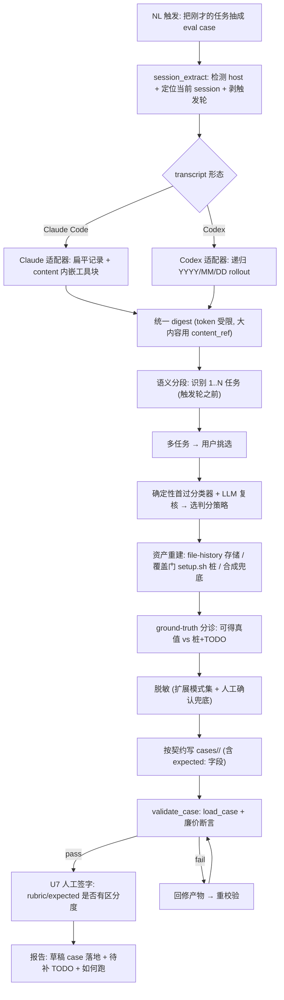
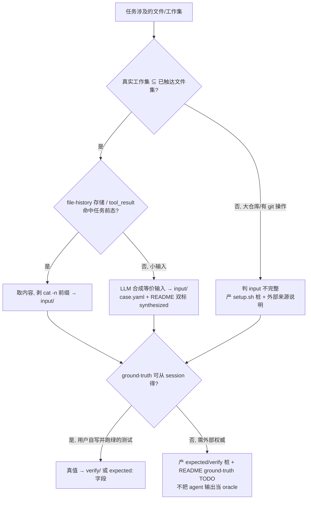

# feat: session-to-eval — 把 session 任务蒸馏成 ai-eval 可执行 case 的可移植 skill

## Summary

做一个**可移植 skill**：在任何项目、任何 session 里说一句"把刚才的任务抽成 eval case"，
它读取**当前 session 的完整 log**（兼容 Claude Code CLI 与 Codex CLI 两端格式），
语义识别出其中的 1..N 个任务（问答 / 跑 skill / 设计 plan / 完成 task / 跑 plugin / 交叉任务），
把每个任务蒸馏成**模型无关、可复现**的 ai-eval case——自动判定它属于四类之一
（reasoning / coding / tool-using / writing），生成对齐 case 契约的目录产物，
落盘前做**静态结构校验**（确保能被 bench 加载、结构完整、非空非占位）。

**关键诚实边界（评审实测后写明）**：自动蒸馏天然弱在两处——transcript 里**没有外部验证过的 ground-truth**，
大型工作集（如既有仓库）**无法从 transcript 完整复原**。所以本 skill 的产物默认是**草稿级 case**：
能复原的精确复原、不能复原的生成**带 TODO 的桩 + 人工确认点**，并把"是否有区分度"交给人在落地前签字，
而不是假装 `load_case` 通过就等于"能跑出有意义的分"。

---

## Problem Frame

ai-eval 的价值随**有区分度的**用例量增长，但人工造 case 慢且容易脱离真实工作流。每天与 AI 协作时，
大量"真实任务"在 session 里发生即焚——它们正是最贴合自己工作的 eval 素材。
当前没有任何机制把"刚发生的任务"低摩擦地沉淀成可复现的对比用例。

外部已有"trace → eval"成熟范式（Braintrust 一键把生产 trace 转 test case、LangSmith 采样 run 进 dataset、
Google ADK capture session → evalset、Arize Phoenix），验证了这条路本身是对的；但它们**全部绑定厂商 SDK /
云端 observability trace**，没有一个读本地 CLI agent 的原生 session log 并产出文件式、面向自建 harness 的 case。
本 skill 填的正是这个生态位：**本地 CLI transcript（Claude Code + Codex）→ ai-eval 目录契约**。

**已知的语料偏置（不掩盖）**：语料来自作者自己在 Claude Code / Codex 上跑过的 session，天然偏向
"host 模型已经能推进的任务"——模型短板上的失败/弃坑更难被蒸馏成干净的"已完成任务"。因此 session 蒸馏是
**拓宽语料的补充来源，不是主来源**；针对已知模型短板的手写 case 仍不可替代。可选地，也允许蒸馏"host 模型卡住/失败"
的任务（它们往往最有区分度）。

---

## Requirements

### 捕获与解析

- R1. skill 可被自然语言触发（如"把刚才你执行的任务抽成一个 eval case"），在任意项目/session 生效。
- R2. 定位并读取**当前 session 的完整 log**，兼容两端真实布局：
  Claude Code `~/.claude/projects/<编码cwd>/<sid>.jsonl`（扁平 `user`/`assistant` 记录，工具调用是
  `message.content[]` 里的 `tool_use`/`tool_result` 嵌套块）；
  Codex **递归** `~/.codex/sessions/**/rollout-*.jsonl`（按 `YYYY/MM/DD` 嵌套，`{type,payload}` 流）。
- R3. 把原始 transcript（可达 MB 级）压成 **token 受限的结构化摘要**（digest），不把上下文撑爆。
- R4. **触发轮 cutoff**：识别"抽成 case"这条触发指令及其之后由 skill 驱动的轮次，排除出任务区——
  蒸馏的是触发**之前**的真实任务，不把元指令本身当成任务。

### 任务识别与归类

- R5. 从 digest 语义识别出 1..N 个任务，覆盖问答 / skill / plan / task 执行 / plugin / 交叉任务等形态。
- R6. 把每个任务归入四类之一（reasoning / coding / tool-using / writing），并据此选定判分策略；
  归类用**确定性首过分类器 + LLM 复核**（首过可被 pytest 覆盖，不依赖真 LLM）。
- R7. 多任务时默认"一任务一 case"，由用户挑选要落地哪些（含全选）。

### 抽象与产出

- R8. 产出**模型无关且自包含**的任务 prompt——剥离指向具体模型/启动器/本机绝对路径的内容；
  对**宿主耦合任务**（依赖某 skill/slash、宿主专属工具、特定工作区布局）做可移植性分诊：
  能解耦则解耦，不能则置 `requires_engine` 并在 README 标注可移植性受限。
- R9. 生成符合 ai-eval 契约的 case 目录：`case.yaml`（含 `expected:` **字段**，非目录）+ `prompts/task.md`
  + rubric/check + 必要的 `input/`/`verify/` + 单 case `README.md`，class 正确、命名合规。
- R10. **输入资产重建（诚实分级）**：
  优先从 session 精确复原任务前的文件——内容来自 Claude Code 的**独立 file-history 存储**
  （`~/.claude/file-history/<sid>/<hash>@vN`，transcript 的 `file-history-snapshot` 只存引用）与
  Read/Write/Edit 的 `tool_result` 块（需剥除 `cat -n` 行号前缀 `^\d+\t`）；
  **复原覆盖门**：当任务真实工作集大于已触达文件集（如在既有大仓库上工作、出现 git 操作），
  判为"input 不完整"，产出 `setup.sh` 桩 + 外部来源说明，而不是落一份跑不起来的碎片 input/；
  彻底复原不到的小输入才用 LLM 合成语义等价近似，并在 **case.yaml 和 README 双标 `synthesized`**。
- R11. **Ground-truth 来源分诊**：区分"session 内可得真值"（罕见：用户自己写并跑绿的测试）与
  "需外部权威的真值"（常见：commit hash、rubric 阈值、oracle 测试）。后者**不得**把 agent 自己的输出
  提升为 oracle（否则 check 自证、比的是模型 vs 一次旧运行而非真相）——生成 `expected`/`verify` 桩 +
  README "ground-truth TODO"，留待人工填权威值。

### 集成与安全

- R12. 通过**配置文件**定位 ai-eval 仓库绝对路径，把生成的 case 写进其 `cases/`。
- R13. 落盘前用 ai-eval 加载器（`bench.case.load_case`）做**静态结构校验**，叠加廉价确定性断言
  （check.sh 可执行且引用脚本存在；check 类 `verify/` 非空；rubric 非空非占位；tool-using/coding 的
  `expected`/`verify` 不得只是 agent 输出的拷贝）。**明确：这只证明结构合法、能被加载，不证明能跑出有意义的分**
  （真正出分校验是后续的可选 dry-run）。
- R14. **密钥安全（P0）**：写入 case 前对 transcript 派生内容脱敏；现有 `bench/scrub.py` 仅覆盖 5 类模式，
  对 transcript 远不够——必须**扩展模式集**（AWS key、`GITHUB_TOKEN`/`gh[pousr]_`、DB 连接串、`.env` 键值、
  PEM 私钥块、JWT 等），并对无法自信脱敏的高熵/关键词命中**升级为人工确认**而非静默落盘；
  session 派生的 `input/` 默认带"未审计敏感数据"提示，不建议未经人工 review 直接提交分享。
- R15. **导入信任边界**：`validate_case` 把 `ai_eval_path` 加进 `sys.path` 前先校验该路径是**真实目录且含
  `bench/__init__.py` 与 `bench/case.py`**、拒绝路径穿越；配置文件视为本地可信输入（文档明示其信任级别）。

---

## Key Technical Decisions

- **v1 覆盖全部四类**：用户明确要全量。用"类别→判分策略矩阵"（见 HTD）把每类收敛到一条确定路径。
  但 coding/tool-using 受 R10/R11 约束——**默认产出草稿级 case（桩 + TODO + 人工确认）**，不假装能一键产出可运行+有真值的 case。

- **双 CLI 适配器，按 transcript 真实布局分流**（评审实测修正）：
  Claude Code 扁平 `{type:user|assistant, message:{role,content[]}}`，工具调用是 content 内嵌块，
  文件内容在**独立 file-history 存储**而非 transcript；
  Codex 递归日期目录下的 `{type:session_meta|event_msg|response_item|turn_context, payload}` 流，
  **无 `archived_sessions/` 假设**。两端差异用统一 digest schema + 两个解析适配器隔离（对照 `bench/adapters/`）。

- **确定性 Python 提取器产出 digest，而非让 LLM 直读原始 JSONL**：transcript 常达 MB 级、单行可能极大。
  由 `session_extract.py` 定位当前 session、剥触发轮、解析两端、读 file-history 存储取文件内容、剥 `cat -n` 前缀，
  产出 token 受限 digest（大文件内容不内联，只放 `content_ref`，由资产重建按需取）。

- **资产重建：session 优先、覆盖门兜底、合成最后**：file-history 存储 + tool_result 是权威来源；
  工作集大于触达集时走 setup.sh 桩；彻底缺失的小输入才合成。这是用户第一性原理的落地，且对"不可复原"诚实标注。

- **Ground-truth 不从 agent 输出自证**：评审实测三个范本的 `expected` 全来自外部研究——本 skill 对需外部权威的真值
  只产桩 + TODO，由 U6 拒绝把"`expected` 仅是 agent 输出拷贝"的 tool-using/coding case 标为完成。

- **校验门只做静态 + 廉价断言，措辞诚实**：`load_case` 证明结构合法、能加载，**不**执行 check.sh、不证明区分度。
  全程措辞改为"静态校验/能被加载"，杜绝"已验证可跑出分"的过度承诺。区分度由 U7 的人工签字 + 后续 dry-run 兜。

- **skill 源码版本化在 ai-eval 仓库内（`case-gen/`），安装为全局 skill**：与契约同仓演进、同套 pytest 守护；
  `install.sh` 软链进 `~/.claude/skills/`（及按需 Codex skills 目录）。运行时读配置拿 ai-eval 路径。

- **简单优先收敛抽象**（CLAUDE.md）：资产重建逻辑**作为 `session_extract.py` 内的函数**而非独立脚本
  （单一消费者、纯取/路由/落盘/标记）；case 契约与分类规则**内联进 SKILL.md 章节**而非散成多个仅被自己读的
  reference 文档。最终脚本只有 `session_extract.py` + `validate_case.py` 两个。

- **脱敏不是简单复用，而是扩展**：以 `bench/scrub.py` 为基线但补齐 transcript 专属模式集（R14），并加人工确认兜底。

---

## High-Level Technical Design

### 端到端流水线



### 类别 → 判分策略矩阵（生成器据此选路）

| class | 典型任务 | check | judge | 关键资产产物 | 结构化答案 | ground-truth 来源 |
|---|---|---|---|---|---|---|
| coding | 补全/改代码使测试过 | `check.sh` 跑测试 | rubric | `input/` 脚手架；`verify/` 只读测试（常需人工补） | 文件产物 | oracle 测试多为外部，默认桩+TODO |
| tool-using | 用 CLI/工具调查得结论 | `check.sh` 抽 `ANSWER:` 比 `expected:` 字段 | rubric | `input/` 工作集（大仓库→setup.sh 桩） | `OUTPUT.txt` 里 `ANSWER:` | 真值多为外部，默认桩+TODO |
| reasoning | 推理/算账/结构化拆解 | none | rubric N 维 | 无或少量 `input/` | `OUTPUT.txt` 全文 | rubric 阈值人工设 |
| writing | 长文/方案/文案 | none | rubric N 维 | 无或少量 `input/` | `OUTPUT.txt` 全文 | rubric 阈值人工设 |

> `expected` 是 `case.yaml` 里的 **YAML dict 字段**（如 `expected.commit` / `expected.max_score`），**不是目录**。
> 矩阵是默认选路：reasoning 任务若恰有确定性可校验答案，可升级为 check+judge 并用。

### 资产重建 + ground-truth 决策流



---

## Output Structure

skill 源码（greenfield 新目录，版本化在 ai-eval 仓库内）：

```
ai-eval/case-gen/
├── SKILL.md                    # 入口：触发描述 + 工作流 + 内联「Case 契约」与「分类规则」章节 + 资产重建/ground-truth 协议
├── scripts/
│   ├── session_extract.py      # 双 CLI 定位+剥触发轮+解析+digest+资产重建函数(读 file-history 存储/剥 cat -n/覆盖门)+脱敏
│   └── validate_case.py        # 路径信任校验 + load_case + 廉价确定性断言
├── config.example.toml         # ai_eval_path = "/abs/path/to/ai-eval"
└── install.sh                  # 软链进 ~/.claude/skills/（及按需 Codex skills 目录）
```

生成产物落点（写入 ai-eval 仓库，非本目录）：`ai-eval/cases/<YYYY-MM-DD-NNN-name>/`，结构同既有 case。

---

## Implementation Units

### U1. skill 骨架 + 配置 + 安装 + 内联契约/分类章节

- **Goal**: 立起可移植 skill 的目录与安装路径，并把"已摸清的 ai-eval case 契约 + 分类规则"内联进 SKILL.md。
- **Requirements**: R1, R9（契约来源）, R12
- **Dependencies**: 无
- **Files**:
  - `case-gen/SKILL.md`（frontmatter + 触发描述 + 工作流占位 + `## Case 契约` `## 分类规则` 章节）
  - `case-gen/config.example.toml`、`case-gen/install.sh`
  - `tests/test_case_gen_install.py`
- **Approach**: SKILL.md 遵循开放 skill 标准（Claude Code + Codex 双端可用）。**契约内联**为 SKILL.md 章节
  （而非独立 reference 文档，CLAUDE.md 简单优先）：逐条写死 `case.yaml` 字段（`name`/`class`/`task`/`check`/`judge`/
  `requires_engine`/`repeat`/**`expected` 为 dict 字段**）、目录语义（`input/` 进 workdir、`verify/` 防篡改基准不进
  workdir、`OUTPUT.txt` 落点、命名 `YYYY-MM-DD-NNN-name`）。`install.sh` 软链而非拷贝；目标已存在且非预期软链则报现状不覆盖。
- **Patterns to follow**: `cases/2026-06-02-001-fizzbuzz/` 的目录与字段；`agent-skill-creator` 开放标准。
- **Test scenarios**:
  - happy: `install.sh` 干净 HOME 下软链成功、指向 `case-gen/`。
  - edge: 目标已是正确软链 → 幂等；已存在且非目标 → 拒绝覆盖并报现状。
  - 断言 `config.example.toml` 含 `ai_eval_path` 字段。（`test_case_gen_install.py` 收敛为这几条，install 幂等性细节走 README smoke test）
  - `Covers R12.`
- **Verification**: 软链到位、SKILL.md 契约章节覆盖全部 case.yaml 字段（含 expected 为 dict）与目录语义、example 字段名正确。

### U2. 双 CLI session 提取器 → 统一 digest（含触发轮 cutoff）

- **Goal**: 确定性检测 host、定位当前 session、剥触发轮、解析两端真实布局，产出 token 受限 digest。
- **Requirements**: R2, R3, R4
- **Dependencies**: U1
- **Files**:
  - `case-gen/scripts/session_extract.py`
  - `tests/test_session_extract_claude.py`、`tests/test_session_extract_codex.py`
  - `tests/fixtures/session/claude_sample.jsonl`、`tests/fixtures/session/codex_rollout_sample.jsonl`（小型脱敏夹具）
- **Approach**: 检测 host（环境标记 / 可用目录）。
  Claude Code：由 `cwd` 推编码目录名（`/`→`-` 前缀 `-`），取该 project 目录下**最新 mtime** 的 `.jsonl`
  （允许 `--session <path>` 显式覆盖）；**容错逐行解析**（跳过末尾半写/非法 JSON 行，应对读时仍在追加的活 transcript）；
  顶层 `user`/`assistant`，工具调用从 `message.content[]` 内嵌 `tool_use`/`tool_result` 块抽取；索引 `file-history-snapshot`。
  Codex：**递归** `~/.codex/sessions/**/rollout-*.jsonl`（YYYY/MM/DD），按时间戳/mtime 取最新；
  解析 `{type,payload}`，`response_item` 按 `payload.role` 还原对话，`event_msg`/`turn_context`/`compacted` 按需取。
  **触发轮 cutoff（R4）**：匹配触发短语标记触发轮，digest 的任务区只含触发轮**之前**的内容。
  统一 digest schema：`{host, session_path, turns:[{role,text,tools:[{name,args_summary,result_summary}]}],
  file_events:[{path,op,content_ref}], usage_hints}`；文本/结果按上限截断，保留首尾与关键标记（`ANSWER:`/错误栈/diff 头）；
  大文件内容**不内联**，只放 `content_ref`（指回 file-history 存储 hash 或 transcript 偏移）。
- **Patterns to follow**: `bench/adapters/` 统一契约 + 各自解析；`bench/case.py:snapshot_dir` 忽略列表思路。
- **Test scenarios**:
  - happy(Claude): 夹具含 1 用户任务 + 工具调用（content 内嵌块）→ digest 还原任务轮次与工具序列。
  - happy(Codex): 递归目录下 rollout 夹具 → 正确按 `payload.role` 还原对话与事件。
  - edge: 触发轮及其后续轮被排除出任务区（夹具末轮为触发短语）。
  - edge: project 目录多个 `.jsonl` → 选最新 mtime；`--session` 覆盖生效；末尾半写行被跳过不崩。
  - edge: 超大单条 tool_result → 截断且保留 `ANSWER:`/diff 头，digest 总长在上限内。
  - error: 找不到任何 session → 明确报错（Codex 递归零命中也报错而非空 digest）。
  - `Covers R2.` `Covers R3.` `Covers R4.`
- **Verification**: 两端夹具产出结构一致 digest；触发轮被剥；递归 Codex 路径命中；半写行容错；关键标记不丢。

### U3. 确定性首过分类器 + 任务语义分段

- **Goal**: 用可测的确定性首过分类器 + LLM 复核识别 1..N 任务并归类，分类逻辑不再零覆盖。
- **Requirements**: R5, R6, R7
- **Dependencies**: U2
- **Files**:
  - `case-gen/scripts/session_extract.py`（新增 `classify_task(signals) -> class` 函数）
  - `tests/test_classify.py`
  - `SKILL.md`（"任务分段与归类"工作流段落 + `## 分类规则`，含 LLM 复核约定）
- **Approach**: `classify_task` 基于确定性信号做首过：有可跑测试产物→coding；靠 CLI/工具调查得结论（工具调用密集、
  无文件产物、有 `ANSWER:` 形态）→tool-using；纯思辨/算账/拆解→reasoning；长文/方案/文案→writing。
  歧义样本由 SKILL.md 的 LLM 复核覆盖（首过给候选 + 置信，LLM 可改判）。分段规则：以"用户给出独立目标 + 一段 AI
  完成过程"为任务边界，识别交叉任务并标依赖。R7 多任务先列清单（编号 + class + 判分策略），用户挑选（默认全选）。
- **Patterns to follow**: `bench/case.py:VALID_CLASSES`。
- **Test scenarios**:
  - happy: 四类信号样本各命中正确 class（`test_classify.py`，无需真 LLM）。
  - edge: coding vs tool-using 边界（有文件产物 + 有工具调查）→ 首过给出候选 + 低置信触发 LLM 复核标记。
  - happy(分段): 含 2 异质任务的 digest → 列 2 条、class 分别为 coding / writing。
  - `Covers R5.` `Covers R6.`
- **Verification**: 首过分类器 pytest 覆盖四类 + 边界；分段在多任务 digest 上正确切分并标 class/策略。

### U4. 资产重建 + ground-truth 分诊 + 脱敏

- **Goal**: 把工作集复原成 `input/`/`verify/`，对不可复原诚实降级，对真值来源分诊，落盘前彻底脱敏。
- **Requirements**: R10, R11, R14
- **Dependencies**: U2
- **Files**:
  - `case-gen/scripts/session_extract.py`（新增资产重建 + ground-truth + 脱敏函数；不另起脚本，CLAUDE.md 简单优先）
  - `tests/test_reconstruct_assets.py`、`tests/test_scrub_transcript.py`
- **Approach**: 输入 = digest 的 `file_events` + `content_ref`。
  **复原覆盖门（R10）**：先判真实工作集是否大于已触达文件集（大仓库/出现 git 操作的信号）→ 是则判 "input 不完整"，
  产 `setup.sh` 桩 + 外部来源说明，不落碎片 input/。
  否则对每个相关文件：从 Claude Code **独立 file-history 存储**（`~/.claude/file-history/<sid>/<hash>@vN`，
  由 snapshot 引用映射）或最早 `Read` 的 `tool_result` 取**前态**，**剥 `cat -n` 行号前缀 `^\d+\t`** 后写 `input/`；
  末次 `Write`/`Edit` 或末读取后态写 `verify/`。彻底缺失的小输入 → 由调用方（SKILL.md/U7）LLM 合成，本函数落盘并
  在返回结构标 `synthesized:true`（供 case.yaml + README 双标）。
  **ground-truth 分诊（R11）**：可从 session 得（用户自写并跑绿的测试）→ 真值入 `verify/`/`expected:`；
  需外部权威 → 产 `expected`/`verify` 桩 + README "ground-truth TODO"，**不把 agent 输出当 oracle**。
  **脱敏（R14）**：所有落盘内容过扩展脱敏器（在 `bench.scrub` 基线上补 AWS/`gh[pousr]_`/DB 串/`.env`/PEM/JWT 等模式），
  无法自信脱敏的高熵/关键词命中 → 返回 `needs_review` 让 U7 触发人工确认，不静默落盘。
- **Patterns to follow**: `bench/case.py` 的 `input/` vs `verify/` 语义；`bench/scrub.py:scrub_text` 作基线扩展。
- **Test scenarios**:
  - happy: 夹具含某文件 file-history 前态 + 末次 Write 后态 → `input/` 得前态（已剥 cat -n）、`verify/` 得后态。
  - edge(覆盖门): digest 含 git 操作 + 触达集远小于工作集 → 判 input 不完整、产 setup.sh 桩。
  - edge(真值): 需外部权威 → 产 expected/verify 桩 + TODO，不拷 agent 输出；用户自写跑绿测试 → 真值入 verify/。
  - edge(合成): 仅后态无前态的小输入 → 合成并 `synthesized` 双标。
  - error/security: 含 AWS key / `ghp_...` / `.env` 键值 / PEM 块 → 被扩展脱敏；无法自信脱敏 → 标 `needs_review`。
  - error: `content_ref` 损坏 → 跳过并记 warning，不崩。
  - `Covers R10.` `Covers R11.` `Covers R14.`
- **Verification**: 覆盖门/真值分诊/合成三态路由正确；cat -n 剥除；扩展脱敏命中 6 类样本 + 人工确认兜底生效。

### U5. case 产物生成（契约对齐 + 可移植性分诊）

- **Goal**: 把"任务 + class + 判分策略 + 资产"组装成符合契约的 case 目录，prompt 模型无关且自包含。
- **Requirements**: R8, R9, R12
- **Dependencies**: U1, U3, U4
- **Files**:
  - `SKILL.md`（"产物生成"工作流段落 + 内嵌模板）
- **Approach**: 据配置 `ai_eval_path` 解析目标 `cases/` 与下一个 `NNN`（扫当日已有目录；并发碰撞作为 v1 已知限制，
  单用户低概率，见 Open Questions）。按矩阵生成：`case.yaml`（正确 `name`/`class`/`task`/`check`/`judge`/
  **`expected:` dict 字段**，含 `synthesized` 标记位）、`prompts/task.md`（模型无关 + **自包含**：剥模型/启动器/绝对路径，
  且正向校验所有引用资产都在 `input/` 内、无宿主专属动词）、`prompts/rubric.md`（judge 类必带 + JSON 输出约定）、
  `check.sh`（check 类，读 cwd/`OUTPUT.txt`，退 0=pass）、`input/`/`verify/`（U4 产物）、单 case `README.md`
  （任务说明 + 判分方式 + **合成资产/ground-truth TODO/未审计提示**标注）。
  **可移植性分诊（R8）**：检出宿主耦合任务（skill/slash 调用、宿主专属工具、工作区布局依赖）→ 置 `requires_engine`
  并 README 标注；不可解耦且无法自包含 → 拒绝该任务并明确告知。tool-using 类在 task.md 约定 `ANSWER:` 输出，check.sh 抽取比对 `expected:` 字段。
- **Patterns to follow**: `cases/2026-06-02-001-fizzbuzz`（check+judge）、`cases/2026-06-03-003-planning`（judge-only）、
  `cases/2026-06-03-001-git-bisect-bug-hunt`（tool-using 抽 ANSWER + setup.sh）三个范本对应三条生成路径。
- **Test scenarios**:
  - happy(coding): `case.yaml` `class: coding`、`check.type: script`、`judge.enabled: true`，`verify/` 测试位、`input/` 脚手架。
  - happy(reasoning): `class: reasoning`、`check.type: none`、rubric 含 JSON 约定、`expected:` 字段有 max_score 等。
  - happy(tool-using): task.md 含 `ANSWER:` 约定 + check.sh 抽取，`expected:` 为字段（非目录）。
  - edge(自包含): task.md 不残留模型/启动器名与绝对路径，且引用资产都在 input/ 内（正向断言，非仅 token 缺失）。
  - edge(可移植): 宿主耦合任务 → 置 `requires_engine` + README 标注。
  - edge(命名): 当日已有 `-001-` → 取 `-002-`，kebab 合规。
  - `Covers R8.` `Covers R9.`
- **Verification**: 三类各生成一个 case，字段/命名/expected 为字段均合规；task.md 模型无关+自包含；可移植性分诊生效。

### U6. 落盘校验门（静态 + 廉价断言，措辞诚实）

- **Goal**: 生成后用 ai-eval 加载器 + 廉价确定性断言校验结构合法、非空非占位、真值非自证；措辞不过度承诺。
- **Requirements**: R13, R15
- **Dependencies**: U5
- **Files**:
  - `case-gen/scripts/validate_case.py`
  - `tests/test_validate_case.py`
- **Approach**: **路径信任校验（R15）**：`ai_eval_path` 必须解析为真实目录且含 `bench/__init__.py` 与 `bench/case.py`、
  拒绝路径穿越，才加 `sys.path`。调用 `bench.case.load_case(<新case目录>)`——抛 `CaseError` 即判失败并回传原文。
  叠加**廉价断言**：judge 类 rubric_file 非空非占位；check 类 `check.sh` 可执行且引用脚本存在、`verify/` 非空；
  task.md 非空；**tool-using/coding 的 `expected`/`verify` 不得只是 agent 输出拷贝**（命中则判"真值待补"非完成）。
  失败回传具体缺口供 U7 回修。**所有面向用户的措辞**统一为"静态结构校验 / 能被 bench 加载"，
  明确**不**证明能跑出有意义的分（dry-run 留作后续）。
- **Patterns to follow**: `bench/case.py:load_case` 的校验抛错路径。
- **Test scenarios**:
  - happy: U5 合规 case → load_case + 廉价断言通过。
  - error: `class` 非法 / 缺 rubric_file / rubric 占位 / `verify/` 空 → 准确报缺口。
  - error: tool-using 的 `expected` 仅是 agent 输出拷贝 → 判"真值待补"非完成。
  - security: `ai_eval_path` 不含 bench/ 或含穿越 → 拒绝加 sys.path 并明确报错。
  - `Covers R13.` `Covers R15.`
- **Verification**: 合规过、各类残缺/自证/不安全路径准确拦截；用户措辞无"已验证可跑出分"式过度承诺。

### U7. SKILL.md 编排 + 触发 + 多任务 UX + 人工签字 + 端到端串联

- **Goal**: 串成一句话触发的闭环，含触发描述、任务清单选择、合成/人工确认触发点、区分度人工签字、回修循环、报告。
- **Requirements**: R1, R5, R7, R10（合成触发点）, R14（人工确认）
- **Dependencies**: U1, U2, U3, U4, U5, U6
- **Files**:
  - `SKILL.md`（完整工作流 + 触发描述 + 报告模板）
  - `tests/test_session_to_eval_e2e.py`（用夹具 transcript 跑脚本链，断言生成 case 过 `load_case`）
- **Approach**: SKILL.md `description` 写清触发词。工作流：`session_extract`（剥触发轮）→ 回显所读 session 路径供确认 →
  展示任务清单（编号 + class + 判分策略）→ 用户挑选 → 逐任务资产重建（缺前态时此处 LLM 合成；`needs_review` 命中时
  触发人工确认脱敏）→ ground-truth 分诊 → 生成产物 → `validate_case` → 失败回修重校验 →
  **区分度人工签字（产品门）**：把 rubric/expected 摆给用户确认"这个 case 真能区分模型吗"，未签字的标为草稿不计入可信语料 →
  报告每个 case 落点、class、判分方式、**待补 TODO（ground-truth / setup.sh / 合成资产 / 未审计提示）**、如何跑
  （`./run.sh -c <case> -r <runners>`）。端到端测试用脚本链（非真 LLM）验证确定性骨架可跑通。
- **Patterns to follow**: `README.md` 的"加一个用例"与"运行"段落。
- **Test scenarios**:
  - happy(e2e): Claude 夹具 → 脚本链产出 coding case → `load_case` 通过。
  - happy(多任务): 含 2 任务夹具 → 清单列 2 条，选 1 只生成 1 个。
  - edge: 未配置 `ai_eval_path` → 先给配置指引并安全停止。
  - edge: `needs_review` 命中 → 人工确认门触发，未确认不落盘该文件。
  - `Covers R1.` `Covers R7.`
- **Verification**: 端到端骨架两端夹具跑通并过校验门；触发轮剥除、人工确认、区分度签字、回修分支行为符合预期。

---

## Scope Boundaries

### 本计划包含
- 可移植 skill（2 脚本 + SKILL.md 内联契约 + 安装）、双 CLI 真实布局解析、触发轮 cutoff、四类识别与确定性首过归类、
  诚实分级的资产重建 + 复原覆盖门、ground-truth 分诊、扩展脱敏 + 人工确认、契约对齐生成、静态校验门、区分度人工签字。

### 明确非目标
- **不改 ai-eval 的 bench 编排器 / 判分 / 计分卡**——skill 只造草稿 case，跑评测出分仍由 `./run.sh` 负责。
- **不自动运行生成的 case 出分**（生成即交付草稿，是否跑由用户决定）。
- **不做云端 trace 接入**（只读本地 CLI transcript；与 Braintrust/LangSmith 的分界）。
- **不保证自动产出"可运行 + 有外部真值"的 case**——大工作集与外部真值默认产桩 + TODO，由人补全。

### 后续跟进（Deferred to Follow-Up Work）
- 生成后**可选 dry-run**：用廉价 runner 实跑校验 check/judge 真能判分、真有区分度（U6 只做静态 + 廉价断言）。
- `requires_engine` 受限的 skill/slash 类 case 的跨引擎可移植性深化处理。
- 一段 session 产出**多 case 的依赖编排**（交叉任务的组合 case）。
- session 派生 case 的**分享前敏感数据审计**机制（超出正则脱敏的 base64/非标键名/多行 PEM 残留）。

---

## Risks & Dependencies

- **file-history 存储格式依赖 Claude Code 内部实现**——`~/.claude/file-history/<sid>/<hash>@vN` 是非公开布局，
  可能随版本变。缓解：把读取集中在资产重建一处，命中不到即降级到合成/桩，不让格式变更阻断主流程。
- **当前 session 定位靠"最新 mtime"启发式 + 读时仍在追加**——并发多 session 误选 / 末尾半写行。
  缓解：`--session` 显式覆盖、回显所读路径供确认、容错逐行解析跳过半写行。
- **Codex rollout schema 随版本漂移**（现 codex-cli 0.137.0，递归 YYYY/MM/DD 布局）——解析容错（未知 `type` 跳过），
  schema 假设集中在 Codex 适配器一处。
- **Claude Code 长 session 压缩**——磁盘 JSONL 保留压缩前全量记录，读文件优于读窗口；解析需覆盖含 summary 记录的 session。
- **正则脱敏不可能穷尽**——base64 凭证、非标键名、多行 PEM 可能漏。缓解：高熵/关键词命中升级人工确认，
  session 派生 input/ 默认带"未审计"提示，分享前审计列入后续。
- **LLM 合成/近似输入可能丢失模型区分度**——按用户第一性原理可接受，但 case.yaml + README 双标 `synthesized`，
  且区分度由 U7 人工签字兜，避免低保真 case 与手写 case 等权进语料。
- **依赖**：Python 3.11+（ai-eval 既有要求）；`bench.case`/`bench.scrub` 作为被复用契约（其字段变更影响 U4/U5/U6，
  靠 SKILL.md 内联契约章节 + 校验门兜住）。

---

## Open Questions

- **可选 dry-run 是否进 v1**：v1 用"静态 + 廉价断言 + 人工区分度签字"挡低信号 case；是否值得在 v1 末加"用最便宜
  runner 跑一遍"的开关？倾向后续，但若你常担心 rubric/check 形同虚设可提前。
- **生成的 case 是否默认 gitignore / 分享模型**：session 派生 input/ 可能含未审计敏感数据。是否默认不入版本控制、
  只在人工审计后再提交？影响 R14 的脱敏严格度口径（本地自用 vs 推到共享仓差异巨大）。
- **并发同日生成的 NNN 碰撞**：单用户低概率，v1 作已知限制接受，还是用锁/原子目录创建？倾向接受。
- **skill 源码位置最终拍板**：默认 `ai-eval/case-gen/` 软链全局；若要纯全局独立仓需另立契约同步机制，默认不走。

---

## Sources / Research

- ai-eval case 契约（生成器事实源）：
  - `bench/case.py`（`VALID_TASK_TYPES`/`VALID_CLASSES`、`Case`/`CheckSpec`/`JudgeSpec`、`load_case`、
    **`expected` 为 dict 字段**、`input_dir`/`verify_dir` 而无 `expected_dir`、`snapshot_dir` 忽略列表）。
  - `bench/scoring.py`（check 读 cwd、judge rubric + 抗注入 + JSON 输出契约）。
  - `bench/orchestrator.py`（`OUTPUT.txt` 落点、`PROMPT.txt` 约定）。
  - `bench/scrub.py`（`scrub_text` 仅 5 类模式——脱敏基线，须为 transcript 扩展）。
  - 范本 case：`cases/2026-06-02-001-fizzbuzz`（check+judge）、`cases/2026-06-03-003-planning`（judge-only）、
    `cases/2026-06-03-001-git-bisect-bug-hunt`（tool-using 抽 `ANSWER:`，input/repo 由 `setup.sh` 全历史 clone、
    `expected` 真值来自 GitHub issue/PR——印证大工作集与外部真值不可从 transcript 复原）。
- transcript 真实格式（本机实测，评审修正）：
  - Claude Code：`~/.claude/projects/<编码cwd>/<sid>.jsonl`，扁平 `user`/`assistant`，工具调用是 `message.content[]`
    内嵌 `tool_use`/`tool_result` 块（Read 结果带 `cat -n` 前缀）；`file-history-snapshot` **只存引用**，
    文件内容在独立 `~/.claude/file-history/<sid>/<hash>@vN` 存储。
  - Codex：**递归** `~/.codex/sessions/YYYY/MM/DD/rollout-*.jsonl`（无 `archived_sessions/`），
    `{type:session_meta|event_msg|response_item|turn_context|compacted, payload:{role,content}}`；codex-cli 0.137.0。
- 先验技术（验证范式、界定差异）：trace→eval 已成熟但全部绑定厂商 SDK/云 trace——
  [Braintrust 一键 trace→test case](https://www.braintrust.dev/articles/agent-observability-complete-guide-2026)、
  [LangSmith 采样 run 进 dataset](https://www.langchain.com/langsmith/evaluation)、
  [Google ADK capture session → evalset](https://google.github.io/adk-docs/evaluate/)、
  [Arize Phoenix replay/build datasets](https://arize.com/blog/open-source-coding-agent-tracing/)。
  本 skill 差异点：本地 CLI transcript → 文件式自建 harness case，无人覆盖的生态位。
